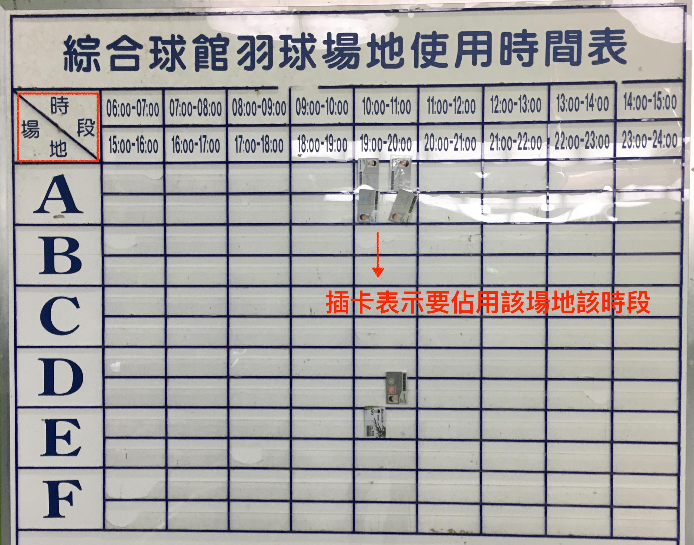
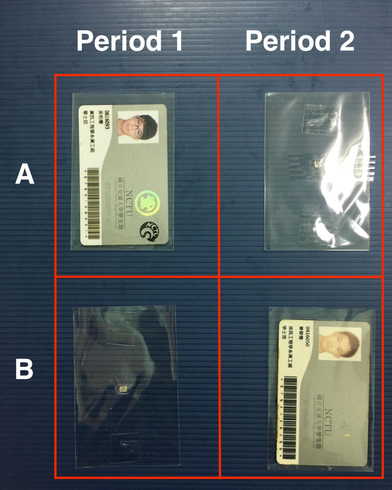
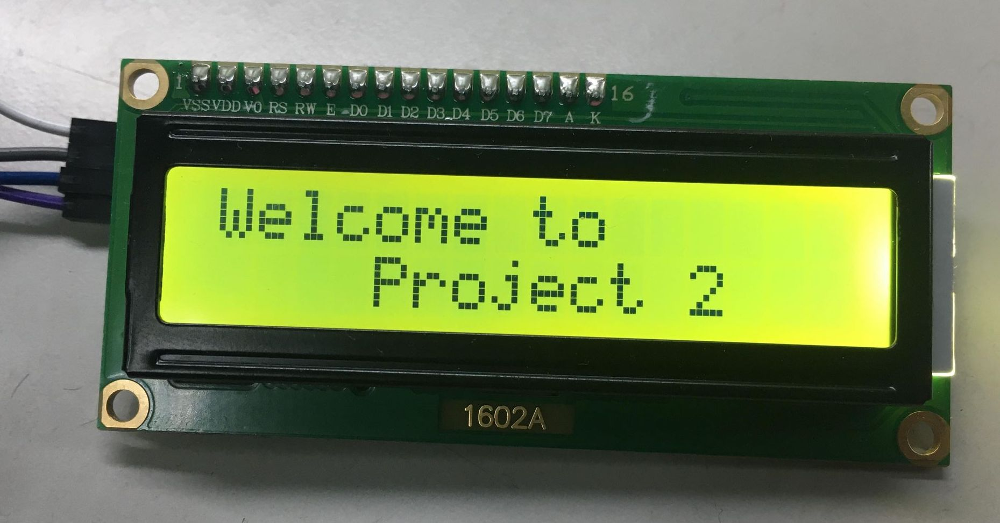
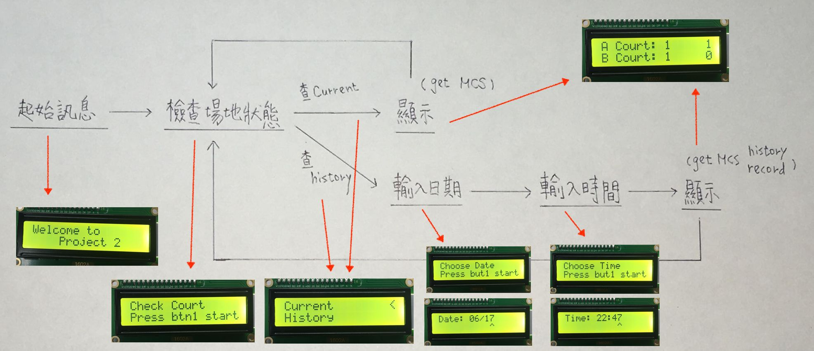

### 物聯網專題：球場使用情形監控

-  **初衷：**
   現交大球場採用現場插卡使用的模式決定場地使用權，但卻缺乏有效的監控，導致許多時候，使用者到球場後才發現沒有空閒的場地，浪費大量的時間，因此想建構一套系統用以實時監控場地使用狀況，並可遠程讀取，甚至透過了解過去的使用資訊，來推估未來的使用情形

   
   
圖1. 羽球場卡片插槽
 

- **實作內容：**
  - 判斷場地是否被佔用
    1. 若有佔用場地，則佔用者須在球館該場地該時段插卡，若無，則不應有人插卡，因此是否佔用可用有無插卡來判斷
    2. 插卡後，會遮蔽光源，因此我組在卡槽背板上加裝光敏電阻，依電值判定是否插卡（場地是否被佔用）
    3. 由於目標是該資訊可讓遠端的人得知，因此將資料上傳MCS
    4. 為方便實作測試，我組用壓克力板做出模擬的卡槽，一則減少需要電子元件，一則免去到體育館測試的時間成本，如下圖，便代表A場地第一時段與B場地第二時段有人使用，其他時段則無

       
       
圖2. 模擬卡槽
 

  - 查詢場地狀況（包含實時監控與歷史紀錄查詢）

    1. 由於可查詢的不止實時狀態，還可以查詢歷史紀錄，因此必然需要一個可互動的介面（顯示結果與輸入查詢項目、時間等）
    2. 經過價錢與實用性考量，我組採用LCD1602的顯示器輸出與按鈕輸入

       
       
圖3. LCD顯示器
 
    
    3. 互動介面的流程圖如下，其中顯示狀態的部分會從MCS查詢資料，但按鈕資訊則不會上傳至MCS再下載，因為這樣設置可能有長達近十秒的延遲，並不符合現實操作需求，而邏輯上，輸入與顯示器必然在一起，沒有遠端存取的需求，也沒有上傳的意義
    
       
       
圖4. 流程圖
 

- **使用電子元件：**
  - Sensor:
    1. LDR * 4: 光敏電阻，應光亮程度改變阻值，越亮阻值越低
    2. 按壓式按鈕 * 2: 具狀態之按鈕，第一次按為0，第二次按為1，以此類推
  - Actuator
    1. LCD1602 * 1: 顯示器，透過I2C驅動，最多可顯示2行，一行16個字元
     
- **程式碼解析：**
  - 在程式碼中有詳細的註解，可參看，這裡僅就重點或部分特殊的手法進行說明
  - LDRWithMCS.py
    - 內容：有四個光敏電阻sensor，分別置於模擬的球場卡槽後端，讀取電阻值，並上傳MCS
    1. 與之前的做法沒有太大的差異，只不過sensor改成四個，分別讀取後，再上傳MCS
    2. BCM的針腳太難尋找，因此都使用BOARD的模式

  - LCDOutput.py
    - 有兩個按鈕跟LCD輸出，程式可查詢現在狀況跟歷史狀況，查詢歷史狀況後需用按鈕輸入日期與時間，從MCS下載資訊並顯示後可回到初始狀態接受下一次查詢
    1. LCD互動介面由於不知道何時會給入下一個輸入（可能下一秒，也可能十分鐘後），因此用類似DFA（決定性有限狀態機）的方式實作，紀錄當前的state，並接受不同輸入決定轉移（如but_1, but_2）
    2. 由於買入的按鈕有狀態（0 or 1），因此不能直接讀入input的值決定是否按下按鈕，而是要看是否與上一次的按鈕輸入值不同決定是否按下
    3. 在輸入日期跟時間時，皆用整數存，前兩數字（千位百位）為月份/小時，後兩數字（十位個位）為日期/分鐘
    4. 原本查詢歷史紀錄應該給出"start"跟"end"兩個參數，說明查詢時間範圍，但測試發現，給予"end"，程式便會自動搜尋該時間前最後一次更動的值，因此不用考慮區間問題
    
  - javascript:
    - 內容：依LDR電阻值，判斷使否有人使用球場
    1. A_court_1 ~ Ｂ_court_2的通道皆是是開關，但開關無法查詢歷史紀錄，因此我組用了一個顯示器類型的資料通道用來記錄歷史紀錄，當我們要查詢歷史紀錄的話就從這個通道抓資料 

- **展望：**
  - 不單單透過LDR判斷是否有插卡，還可透過NFC sensor讀取卡片資訊，進行更深層的分析，例如各系運動情形、每週場地空閒時間⋯⋯
  - LCD的人機互動介面過於簡單，之後應加入更多分析選項，不單單只有現在狀態與歷史紀錄可查詢

- **Demo 影片連結：**
  - [LDR感測卡槽上傳MCS](https://youtu.be/Bat3iaDfXPA)
  - [LCD顯示現在球場狀態](https://youtu.be/B_y5uxlP-BU)
  - [LCD輸入時間，查詢使用狀態](https://youtu.be/fMSAGpTF7hQ)

