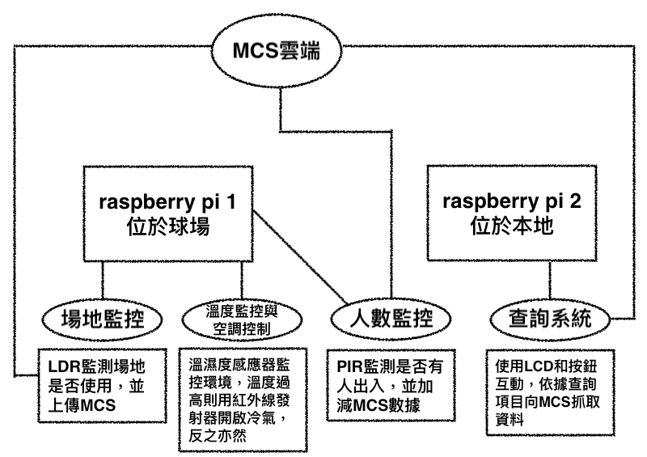
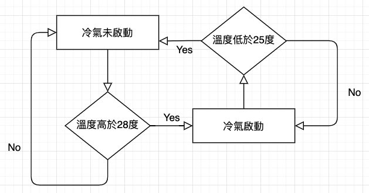
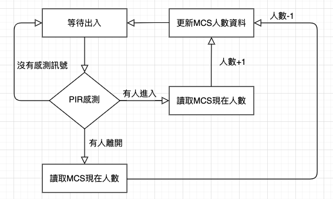

### 物聯網專題改良：球場使用情形監控

- **概要：**
  - 目的：依循原專題主題，做功能的擴展和細分，報告中將不贅述原專題中實現的功能，相關內容可參看原專題的報告與程式碼
  - [原專題連結](https://github.com/1am9trash/IOT/tree/main/project1)

- **實作內容：**
  - 原專題中已經實現的功能
    1. 即時球場使用情形的查詢
    2. 球場歷史佔用紀錄的查詢
  - 擴展部分
    1. 使用兩台raspberry pi，完成互動
       - 使用兩套主機完成球場監控系統，一套為球場監控，另一套為本地查詢
       - 球場監控系統：包括場地是否使用的判定（LDR）、溫濕度感應、冷氣遙控（IR LED）、人數監控（PIR）
       - 本地查詢系統：包括顯示器（LCD）互動介面，可按需求抓取球場端post到MCS雲端的資料
    2. 球場溫度調控功能
       - 我校規定，28°C以上才能開冷氣（羽球場），但要開的時候必須通知管理員，再請管理員幫忙控制，毫無疑問，這相當缺乏效率，有硬性標準的監控完全可以做到自
       動化
       - 先使用溫濕度感測器監控溫度，判斷是否高於28度，若高於則用紅外線發射器開啟冷氣，反之低於25度則關閉
    3. 球場人數統計功能
       - 使用紅外線感測器感測人的移動，並判斷是否有人進入／離開球館，藉此統計球館內人數

- **系統流程圖：**
  - 總覽圖：包含raspberry pi的分工及MCS的互動

    
    <center style="font-size:15px;color:#3f3f3f;text-decoration:underline">圖1. 總覽圖</center>

  - 溫度調控流程圖：raspberry pi 1（球場）

    
    <center style="font-size:15px;color:#3f3f3f;text-decoration:underline">圖2. 溫度調控</center>

  - 球場人數統計流程圖：raspberry pi 1（球場）

    
    <center style="font-size:15px;color:#3f3f3f;text-decoration:underline">圖3. 人數統計</center>
  
- **使用電子元件：**
  - Sensor:
    1. LDR * 4: 光敏電阻，應光亮程度改變阻值，越亮阻值越低
    2. 按壓式按鈕 * 2: 具狀態之按鈕，第一次按為0，第二次按為1，以此類推
    3. PIR * 1: 紅外線傳感器，可感應物體移動
    4. temp/humidity sensor * 1: 感應溫度
  - Actuator
    1. LCD1602 * 1: 顯示器，透過I2C驅動，最多可顯示2行，一行16個字
    2. IR LED * 1: 紅外線發射器
    3. LED * 1: 一般的可見光發射器

- **程式碼解析：**
  - 在程式碼中有詳細的註解，可參看，這裡僅就重點或部分特殊的手法進行說明，另外，Code檔案夾中僅附上此次有改變或新增的程式碼
  - LCDOutput.py
    - 功能：有兩個按鈕跟LCD輸出，程式可查詢現在狀況、歷史狀況及球場內人數，查詢歷史狀況後需用按鈕輸入日期與時間，從MCS下載資訊並顯示後可回到初始狀態接受下一次查詢
    - ```class FSM()```: LCD互動介面由於不知道何時會給入下一個輸入（可能下一秒，也可能十分鐘後），因此用類似FSM（有限狀態機）的方式實作，紀錄當前的state，並接受不同的輸入決定轉移（如but輸入） 
    - ```getToMCS()```: 從雲端下載資料，因為增加查詢歷史紀錄功能，因此增加```history```參數，利用http的現成語法查詢，若要直接查詢現在的資料，則```history```傳入空字串
    - ```printOnLCD()```: 控制LCD的輸出
    - ```showDate()```: 輸入日期時，即時顯示顯在的值，並用箭頭指出現在修改的值
    - ```addDate()```: 每次按下btn[0]，箭頭指向的值會加一，但觸碰邊界時會回到下界（不會出現13月之類的輸入）
    - ```showTime()```和```addTime()```: 與date類似，不做贅述
    - ```isButPressed()```: 判斷按鈕是否被按過，由於買入的按鈕有狀態（0 or 1），因此不能直接讀入input的01值決定是否按下按鈕，而是要看是否與上一次的按鈕輸入值不同決定是否按下
    - ```showNumOfPeople（）```: 調用```getToMCS()```查詢狀態並用```printOnLCD()```印出，需注意得到人數位數未必相同，需調整印出的空格數 
    - ```showRecord()```: 調用```getToMCS()```查詢狀態並用```printOnLCD()```印出
    - ```transportTime()```: 由於查詢歷史紀錄時，http用的```end```參數的值為UTC格式的秒數，因此設計一函數轉換時間
  - acControl.py
    - ```Adafruit_DHT.read_retry(DHT_SENSOR, DHT_PIN)```: 讀取溫濕度感應器input針腳資料
    - ```os.system('irsend SEND_ONCE AC KEY_POWER')```: 透過os調用linux指令，SEND_ONCE表示發送一次訊號，該訊號為AC庫中的KEY_POWER訊號
  - lircd.conf
    - 儲存IR LED輸出訊號的格式
  - addPeople.py
    - ```printPost()```: 印出上傳的狀態、內容及最後更新時間
    - ```getNumberOfPeople()```: 從MCS上get人數資料
    - ```postNumberOfPeople()```: 當感應到有人進入時，調用```getNumberOfPeople()```得到當前人數，並將其加1，重新上傳
  - minusPeople.py
    - 邏輯與 addPeople.py 相同，不做贅述


- **困境：**
  - 原本是想要透過IRM（紅外線接受器）錄製冷氣遙控器訊號，再在```irsend```指令中調用該訊號控制冷氣開關，但礙於技術問題（似乎是硬體不支援）沒有達成，最後只能上網查找冷氣控制訊號，用以控制IR LED
  - raspberry pi網路一直無法連線，後來使用```rfkill unblock```才成功連上校網，另外校網不能連通常常不是因為沒有打開權限，而是因為校網需要登入
  - 我們使用的PIR目前太過敏感，因此我們每次感測需要有數秒的等待時間，不然一個人會被計算多次

- **展望：**
  - 現在查詢只能透過本地端的raspberry查詢，希望可以直接透過Line Robot之類的程式查詢，真正實現人人可即時得知球場狀態的初衷
  

- **Demo 影片連結**
  - [球場使用狀態與LCD查詢](https://youtu.be/eCw9ROUp9cQ)
  - [PIR移動感測與人數監控](https://youtu.be/w77u4zL-R2k)
  - [溫度感測與AC遙控](https://youtu.be/XEC6LNoy9rE)