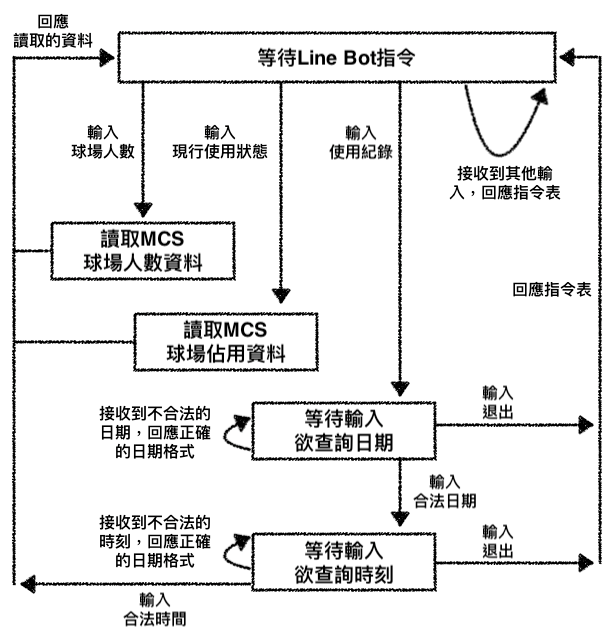

### 物聯網專題終焉：球場使用情形監控

- **概要：**
  - 本專題初衷在於對球場使用情形的監控與統計，在之前的專題中已經完成人數統計、球場使用情形監控與溫度自動化控制等功能，但美中不足的是，球場資訊只能透過raspberry pi查詢，無法實現人人可方便觀看的初衷，因此在這個專題的最後，我們透過Line Bot補上欠缺的功能
  - [原專題連結](https://github.com/1am9trash/IOT/tree/main/project1)
  - [擴增專題連結](https://github.com/1am9trash/IOT/tree/main/project2)

- **實作內容：**
  - 原專題中已經實現的功能
    1. 即時球場使用情形的查詢
    2. 球場歷史佔用紀錄的查詢
    3. 使用兩台raspberry pi，完成互動
    4. 球場溫度調控功能
    5. 球場人數統計功能
  - 擴展部分
    1. Line Bot互動

- **系統流程圖：**
  - 之前已實現功能的流程圖不重複說明，可參看過去的報告
  - 總覽圖：包含raspberry pi的分工及MCS的互動

    
    <center style="font-size:15px;color:#3f3f3f;text-decoration:underline">圖1. 總覽圖</center>

  - Line Bot流程圖：

    
    <center style="font-size:15px;color:#3f3f3f;text-decoration:underline">圖2. Line Bot</center>
  
- **使用電子元件：**
  - Sensor:
    1. LDR * 4: 光敏電阻，應光亮程度改變阻值，越亮阻值越低
    2. 按壓式按鈕 * 2: 具狀態之按鈕，第一次按為0，第二次按為1，以此類推
    3. PIR * 1: 紅外線傳感器，可感應物體移動
    4. temp/humidity sensor * 1: 感應溫度
  - Actuator
    1. LCD1602 * 1: 顯示器，透過I2C驅動，最多可顯示2行，一行16個字
    2. IR LED * 1: 紅外線發射器
    3. LED * 1: 一般的可見光發射器

- **程式碼解析：**
  - Code檔案夾中僅附上此次有改變或新增的程式碼，若對其餘程式有興趣，可參看之前的project
  - config.ini
    - line bot基本資料，供 lineBot.py 讀取
  - lineBot.py
    - 功能：在有line客戶發訊息給此bot時，可做出回應，具體應對如前述流程圖
    - 引入需要的module，除了IOT需要的module外，引入linebot作為line的API，引入flask作為簡易的網頁框架
    
      ```python
      from flask import Flask, request, abort
      from linebot import LineBotApi, WebhookHandler
      from linebot.exceptions import InvalidSignatureError
      from linebot.models import MessageEvent, TextMessage,   TextSendMessage
      import time
      import requests
      import http.client
      import urllib
      import json
      import configparser
      ```
    
    - 透過configparser讀取 config.ini 中的資料，便建立網頁的物件和line的API
    
      ```python
      app = Flask(__name__)
      config = configparser.ConfigParser()
      config.read('config.ini')
      line_bot_api = LineBotApi(config.get('line-bot',   'channel_access_token'))
      handler = WebhookHandler(config.get('line-bot',   'channel_secret'))
      ```

    - 存取MCS帳號的資料

      ```python
      # MCS id and key
      deviceId = "noHacking"
      deviceKey = "noHacking"
      ```
    
    - FSM代表finite state machine，紀錄現在line bot對話的狀態，因為不同狀態需要對不同指令做反應，因此需要加以區分

      ```python
      class FSM():
          choose = 0
          enterDate = 1
          enterTime = 2
      ```
    
    - 由MCS讀取資料，channel代表所要讀的資料的id，history代表讀取何時的紀錄，若查找即時紀錄則為空字串

      ```python
      def getToMCS(channel, deviceId, deviceKey, history):
          host = "http://api.mediatek.com"
          endPoint = "/mcs/v2/devices/" + deviceId + \
              "/datachannels/" + channel + "/datapoints"
          url = host + endPoint + history
  
          headers = {"Content-type": "application/json",   "deviceKey": deviceKey}
          r = requests.get(url, headers=headers)
          value = (r.json()["dataChannels"][0]["dataPoints"][0]  ["values"]["value"])
          return value
      ```

    - 將line客戶傳來欲查詢的時間轉換為毫秒，因為http的end參數接受此型態的數據

      ```python
      def transportTime(date, tim):
          timeString = date + tim
  
          structTime = time.strptime(
              timeString + "00", "%Y/%m/%d%H:%M%S")
          timeStamp = int(time.mktime(structTime))
          return timeStamp * 1000
      ```

    - 將line bot伺服器的資料包含對客戶端的回應post到/callback，line會接受那裡的資訊做出反應
  
      ```python
      @app.route("/callback", methods=['POST'])
      def callback():
          signature = request.headers['X-Line-Signature']
  
          body = request.get_data(as_text=True)
          app.logger.info("Request body: " + body)
  
          try:
              print(body, signature)
              handler.handle(body, signature)
  
          except InvalidSignatureError:
              abort(400)
  
          return 'OK'
      ```
    
    - 判斷字串是否為數字，用於日期與時間的確認

      ```python
      def isNum(str):
          for it in str:
              if it < '0' or it > '9':
                  return 0
          return 1
      ```

    - 判斷日期是否合法，確認字串長度、是否為數字、數字範圍

      ```python
      def chkDate(date):
          print ("\n\n\n", date)
          if len(date) != 10 or (isNum(date[0:4])) == 0 or (int)(date  [0:4]) > 2021 or (int)(date[0:4]) < 0 or date[4] != '/' or   (isNum(date[5:7])) == 0 or (int)(date[5:7]) > 12 or (int)  (date[5:7]) < 1 or date[7] != '/' or (isNum(date[8:10]))   == 0 or (int)(date[8:10]) > 31 or (int)(date[8:10]) < 1:
              return 0
          return 1
      ```
    
    - 判斷時間是否合法，與日期判斷類似

      ```pythonj
      def chkTim(tim):
          if len(tim) != 5 or (isNum(tim[0:2])) == 0 or (int)(tim  [0:2]) > 23 or (int)(tim[0:2]) < 0 or tim[2] != ':' or   (isNum(tim[3:5])) == 0 or (int)(tim[3:5]) > 59 or (int)(tim  [3:5]) < 0:
              return 0
          return 1
      ```

    - choose狀態的指令說明

      ```python
      def replyChoose(event):
          send = "球場查詢 Line Bot 指令:\n" + \
              "球場人數　　　查詢球場內人數\n" + \
              "現行使用狀態　查詢即時球場使用狀態\n" + \
              "使用紀錄　　　查詢球場使用狀態的歷史紀錄"
          line_bot_api.reply_message(
              event.reply_token,
              TextSendMessage(text=send)
          )
      ```

    - 對球場人數查詢的回應

      ```python
      def replyNum(event):
          data = [getToMCS("Number_of_people", deviceId, deviceKey,   "")]
          send = "球場內人數:    " + str(data[0])
          line_bot_api.reply_message(
              event.reply_token,
              TextSendMessage(text=send)
          )
      ```

    - 對現在球場狀態的回應

      ```python
      def replyCur(event):
          dataChnId = ["A_court_1", "A_court_2",
                      "B_court_1", "B_court_2"]
          data = []
          used = ["閒置中", "使用中"]
          for i in range(4):
              data.append(
                  getToMCS(dataChnId[i], deviceId, deviceKey, ""))
          send = "A1 Court:    " + used[data[0]] + "\n" + "A2   Court:    " + used[data[1]] + "\n" + \
              "B1 Court:    " + used[data[2]] + "\n" + \
              "B2 Court:    " + used[data[3]]
          line_bot_api.reply_message(
              event.reply_token,
              TextSendMessage(text=send)
          )
      ```

    - p為現在狀態，state為狀態機的物件，date、tim為客戶輸入欲查詢的日期和時間

      ```python
      p = 0
      state = FSM()
      date = ""
      tim = ""
      ```
    
    - 每當接受到訊息，且訊息為text格式時，呼叫interact做出回應

      ```python
      @handler.add(MessageEvent, message=TextMessage)
      def interact(event):
          global p, date, tim
  
          if p == state.choose:
              if event.message.text == "球場人數":
                  replyNum(event)
              elif event.message.text == "現行使用狀態":
                  replyCur(event)
              elif event.message.text == "使用紀錄":
                  p = state.enterDate
              else:
                  replyChoose(event)
  
          if p == state.enterDate:
              if event.message.text == "退出":
                  p = state.choose
                  replyChoose(event)
              elif chkDate(event.message.text):
                  p = state.enterTime
                  date = event.message.text
              else:
                  send = "使用紀錄查詢 Line Bot 指令:\n" + \
                      "yyyy/mm/dd　按格式輸入欲查詢日期\n" + \
                      "退出　　　　 退出使用紀錄查詢"
                  line_bot_api.reply_message(
                      event.reply_token,
                      TextSendMessage(text=send)
                  )
  
          if p == state.enterTime:
              if event.message.text == "退出":
                  p = state.choose
                  replyChoose(event)
              elif chkTim(event.message.text):
                  p = state.choose
                  tim = event.message.text
                  timeStamp = transportTime(date, tim)
                  history = "?end=" + str(timeStamp)
                  dataChnId = ["A_court_1_occupy", "A_court_2_occupy",
                              "B_court_1_occupy", "B_court_2_occupy"]
                  data = []
                  used = ["閒置中", "使用中"]
                  for i in range(4):
                      data.append(
                          getToMCS(dataChnId[i], deviceId, deviceKey, history))
                  send = date + " " + tim + "\n" + "A1 Court:    " + used[data[0]] + "\n" + "A2 Court:    " + used[data[1]] + "\n" + \
                         "B1 Court:    " + used[data[2]] + \
                         "\n" + "B2 Court:    " + used[data[3]]
                  line_bot_api.reply_message(
                      event.reply_token,
                      TextSendMessage(text=send)
                )
          else:
              send = "使用紀錄查詢 Line Bot 指令:\n" + \
                     "hh:mm　　按格式輸入欲查詢時間\n" + \
                     "退出　   退出使用紀錄查詢"
              line_bot_api.reply_message(
                   event.reply_token,
                   TextSendMessage(text=send)
              )
      ```
    
    - 運行此app的物件

      ```python
      if __name__ == "__main__":
          app.run()
      ```

- **Demo 影片連結**
  - [Line Bot互動](https://youtu.be/Jh1_Jxos3e4)
  - [LDR感測卡槽上傳MCS](https://youtu.be/fMSAGpTF7hQ)
  - [球場使用狀態與LCD查詢](https://youtu.be/eCw9ROUp9cQ)
  - [PIR移動感測與人數監控](https://youtu.be/w77u4zL-R2k)
  - [溫度感測與AC遙控](https://youtu.be/XEC6LNoy9rE)